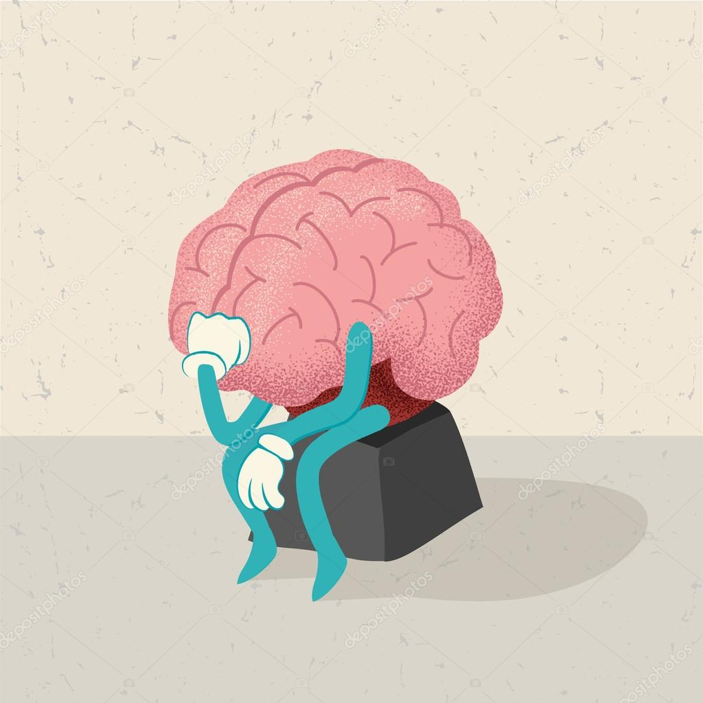

## My Experience With Software Engineering

Software Engineering is much more than being a good programmer. It requires excellent teamwork skills, organization, and the ability to maintain/test/debug software. There’s a huge emphasis on teamwork, especially when working on large scale open source projects. Many people and even companies may rely on your software to work and it’s extremely important to be able to manage your time and produce efficient and readable programs. Building this skillset is extremely important and can be beneficial to all sorts of career fields, not just Software Engineering.

I took an interest in Computer Science during my Freshman year of University. Prior to that year, I had absolutely no experience within the field. Since then, I have taken many more CS courses and have learned many new things and languages. I’m currently familiar with Java, Python, JavaScript, and C languages and hope to gain more experience throughout the next few years. So far I’ve been able to learn about all sorts of programming skills and fundamental concepts such as data structures and object oriented programming. However, these are just the bare necessities in order to become a good software engineer.

Throughout my next few years at University I hope to further improve my skills in order to become an efficient programmer. I want to especially improve my organizational and logical skills because my biggest weakness is overthinking while coding. Code readability is also a huge factor in order to become a good software engineer because it directly relates to teamwork. Having readable code not only makes things ‘prettier’ but it also can help others understand the writer's logic which is extremely important when working on open source projects. The software engineering skill set is extremely beneficial as it teaches key leadership, organizational, and time management skills.
