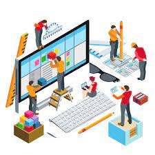

  
  

During my first year of university I attended the University of San Diego. I originally was a Mechanical Engineering major and took the ENGR 101 course. This course gave students an introduction to the field of engineering and enabled students to work in small teams to solve open-ended interdisciplinary design problems, computer aided design (CAD) modeling, and develop team oriented skills. Our final project for this course revolved around using an [arduino](https://www.arduino.cc/) microcontroller to develop and build a robotic vehicle that could carry X amount of weight up a small ramp.

Our project consisted of a team of 5 people and we had 2 months to build and program our vehicle. The first step of this project was to design the structure of our vehicle which was done with SolidWorks. This was a very tedious process because most of us had never used CAD software prior to this course. We had to brainstorm a vehicle model that would allow for an effective way to carry the most amount of weight while maintaining structural integrity and speed. Moreover, a robotic gate system had to also be included in order to release the weights when the vehicle reached the top of the ramp. I suggested to the team that we keep a simple box design with a slightly narrower frontend of the car. This box design would allow us to have a reliable container for the weights and would be easy to build due to its simple geometry.

After we finished our SolidWorks model we had to laser cut wooden pieces in order to actually build the car. This part took longer than expected because the laser cutting lab had a very tight schedule and there were only a few amount of time slots available	throughout the week in order to cut the pieces of wood. Due to this we had to schedule multiple appointments but we eventually were able to obtain all of our necessary parts for the vehicle.

The final step in building the car involved putting together the wooden pieces and hooking up the arduino controller within the vehicle. This was a relatively quick process as it mainly involved gluing pieces together. After assembling the car, we had a few days to test how well it would work. The team was nervous at first but the vehicle surprisingly worked and was able to carry a good amount of weight. When the time came to compete against the other teams we were confident in our creation and we ended up carrying the most amount of weight up the ramp.

This project was very time consuming and our team had lots of issues with procrastination in the beginning. However, we were able to get everything in order and work together as a unit which led us to winning the competition. This project gave me immense insight on how important teamwork is and how it’s important to communicate effectively within your group. Especially since this project had lots of different parts, it’s impossible for one person to do all the work and I realized that many people are depending on you, which can lead to not only you but the whole team failing to complete the task.

