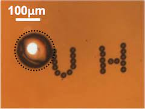

  
  

For our final project for ICS 314 my team and I had to develop an [application](http://137.184.236.187/) using meteor react that would be beneficial to students specifically at UH Manoa. Our team decided to use the Manoa Flea Market template which revolves around the issue of the tremendous amount of campus specific goods that are left behind once students leave the university. This approach is similar to craigslist and has a goal to create a safe marketplace for UH students to get recycled/reused goods such as furniture, textbooks, electronics, etc. 

The home page is fairly simple as you have options to view “Listings”, “My Listings”, and “List an Item”. UH Manoa affiliates will be able to view listings which show an image of the item, the price, negotiability, condition, and also the contact information. Moreover, only users with a ‘hawaii.edu’ email address will be able to use this application. This is intentional in order to have a secure and safe market and also in order to benefit UH students.

This project was a great introduction to the work cycle of a software engineer. This whole semester we learned about the different aspects of software engineering such as project management, coding standards, and the various languages just to name a few. Creating this application required our team to communicate effectively with each other and update our progress on GitHub. Moreover, I was able to learn a lot more about application development as I helped in creating some of the pages within the application and also had to find a way to only allow ‘hawaii.edu’ emails to be the only acceptable email tag.

[GitHub Link](https://manoa-market.github.io/)
